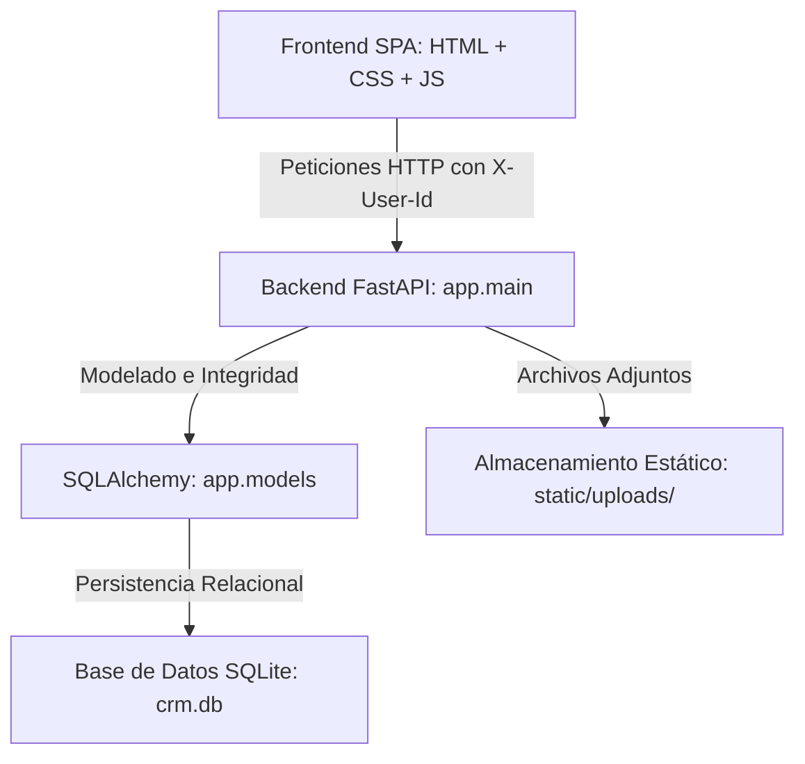
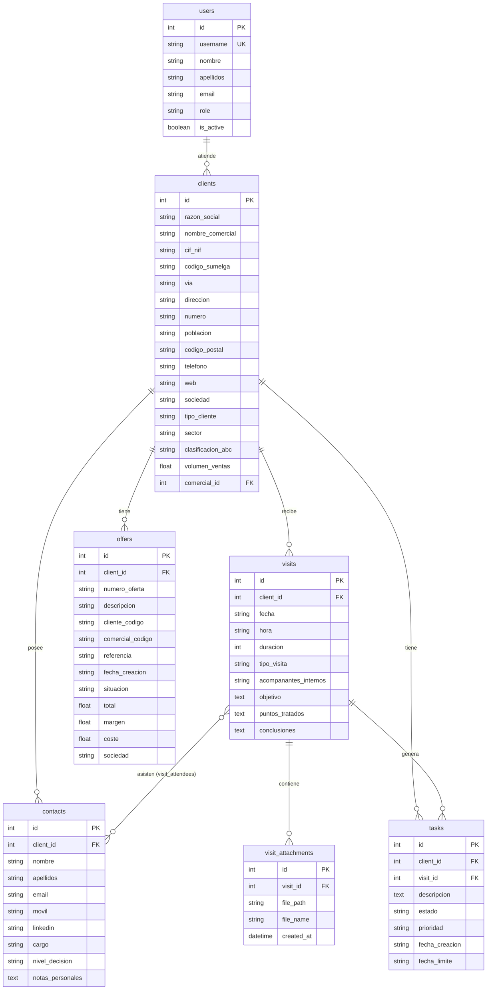

# CRM Sumelga - Sistema Inteligente de Gestión de Ventas e Interacciones

CRM Sumelga es una aplicación web Single Page Application (SPA) ultra-moderna de alta gama, diseñada bajo principios *mobile-first* y estética premium. Ofrece una gestión inteligente y centralizada de organizaciones, personas de contacto, minutas de visitas con dictado por voz integrado, un cuadro de mando con KPIs de negocio en tiempo real, un tablero Kanban de acciones pendientes y un calendario de planificación mensual.

Además, cuenta con un robusto **sistema de roles y privilegios** (Administradores vs. Comerciales) que controla el acceso a la información y restringe funciones críticas en consonancia con la seguridad del backend.

---

## 🛠️ Arquitectura de la Aplicación

La aplicación está diseñada de manera desacoplada en tres capas principales:

1. **Base de Datos (SQLite + SQLAlchemy)**: Integridad relacional estricta, llaves foráneas forzadas por conexión (`PRAGMA foreign_keys = ON;`), eliminaciones o reasignaciones en cascada, e **índices de base de datos optimizados** en campos de clave ajena, ordenación y filtrado común (`comercial_id`, `client_id`, `visit_id`, `fecha`, `fecha_limite`, `role`, `tipo_cliente`, `sector`, `clasificacion_abc`, `tipo_visita`, `estado`, `prioridad`) para garantizar consultas y agregaciones analíticas instantáneas.
2. **Servidor Backend (FastAPI)**: API RESTful robusta y rápida con documentación interactiva integrada en `/docs`, dependencias para inyectar y verificar la identidad del usuario, control de accesos, y consultas optimizadas por lotes (bulk queries) para evitar cuellos de botella del tipo N+1 de base de datos en colecciones grandes.
3. **Frontend SPA Premium (HTML5 + CSS3 + Vanilla JS)**: Interfaz de usuario interactiva y fluida, estilizada con Glassmorphism (efectos de cristal translúcido y desenfoques) y animaciones de última generación. Optimizada para el renderizado eficiente de conjuntos masivos de datos mediante la manipulación en memoria del DOM (evitando el bloqueo del hilo principal de JavaScript).



---

## 💎 Características Principales

### 1. Progressive Web App (PWA) y Mobile-First
- Instalable nativamente en **iOS (Safari)** y **Android (Chrome)** mediante la opción "Añadir a la pantalla de inicio".
- Interfaz adaptativa: las tablas pesadas ocultan columnas secundarias en móviles y los botones se agrupan en vistas táctiles optimizadas.
- Integración nativa con **Share Sheet** (compartir PDF directo por WhatsApp o Correo en teléfonos).
- Scroll inercial suave nativo y soporte para el notch (Safe Areas) de los últimos smartphones.

### 2. Cuadro de Mando (Dashboard)
- Indicadores clave de rendimiento (KPIs) dinámicos: total de clientes activos, visitas mensuales con barra de progreso de objetivos, tareas pendientes y completadas.
- Agenda de visitas de la semana en curso.
- Listado de acciones To-Do urgentes o vencidas con marcado rápido de completado.

### 3. Directorio de Clientes (Cuentas)
- Segmentación por sector (Automoción, Distribución, Industrial, Tecnológico, Otros) y tipo de cliente (CLIENTE FINAL, OEM, SI, CUADRISTA, INSTALADOR).
- Clasificación ABC según volumen de ventas esperado o facturado.
- **Master-Detail Layout**: Vista de tabla elegante a la izquierda y un panel detallado en cascada deslizable a la derecha.
- **Ficha General (Hub)**: Pantalla de resumen principal del cliente con información de la empresa + contactos vinculados a la izquierda, y tres tarjetas KPI (Ofertas en Curso, Historial de Visitas, Acciones Pendientes) a la derecha con botones de acceso rápido a cada módulo detallado.
- Las sub-páginas de **Ofertas**, **Visitas** y **Acciones** son accesibles desde la Ficha General o desde las pestañas superiores de navegación.

### 4. Personas de Contacto
- Gestión de interlocutores clave asociados a cada cliente.
- Calificación de poder de decisión (Decisor, Prescriptor, Usuario, Bloqueador).
- Enlaces de acción rápida para correo electrónico (`mailto:`), llamada (`tel:`) y enlace directo a su perfil de LinkedIn.

### 5. Minutas de Visitas y Dictado por Voz
- Registro completo de interacciones (fecha, hora, duración, tipo de visita, asistentes y acompañantes).
- **Dictado por Voz (Speech-to-Text)**: Integración con la **Web Speech API** nativa (`webkitSpeechRecognition`) para dictar directamente por el micrófono el objetivo, puntos tratados y conclusiones de la reunión.
- **Subida de Adjuntos**: Dropzone interactiva con soporte para arrastrar y soltar (Drag and Drop) ofertas comerciales, fotos o archivos técnicos en cola para subida al guardar.

### 6. Tablero Kanban (To-Do)
- Gestión ágil de acciones mediante columnas de estado (Pendiente, En Progreso, Completada, Cancelada).
- Soporte para **arrastrar y soltar (Drag and Drop)** tarjetas de tareas, que actualiza de inmediato su estado en la base de datos mediante llamadas PUT asíncronas.
- Indicadores de fecha límite con color dinámico de advertencia para tareas vencidas.

### 7. Ofertas Comerciales (ERP)
- Integración de las ofertas del ERP directamente en la ficha del cliente.
- **7.310 ofertas** importadas desde el fichero Excel `Listado ofertas 2026 01_07_26.xlsx` para la sociedad Sumelga.
- KPIs automáticos por cliente: número total de ofertas, importe total ofertado, ofertas abiertas (P) y cerradas (C).
- Exportación de la lista de ofertas a **CSV/Excel** y a **PDF** (impresión nativa del navegador).

### 8. Calendario de Planificación
- Cuadrícula de mes completo generada dinámicamente según la fecha del sistema.
- Celdas interactivas: haz clic en una fecha vacía para programar una visita pre-seleccionando la fecha, o haz clic en los eventos de color (Presencial, Virtual, Telefónico) para abrir y editar la minuta directamente.

### 9. Gestión de Comerciales y Privilegios
- **Selector de Sesión superior**: Un combobox glassmorphic en el header que permite simular la sesión de cualquier comercial o administrador en tiempo real.
- **Rol Administrador**: Visualiza toda la base de datos de manera global, da de alta, edita o elimina comerciales en la pestaña exclusiva **Comerciales** y puede asignar o reasignar cuentas de clientes.
- **Rol Comercial**: Aislado de la nómina de comerciales. Solo visualiza y gestiona las cuentas de clientes asignados a él, así como sus contactos, visitas y tareas asociadas. Sus formularios bloquean u ocultan campos restringidos de asignación.

### 10. Configuración del Sistema (Admin)
- **Módulo Técnico Centralizado**: Pestaña exclusiva para administradores donde gestionar mantenimientos.
- **Importación de Ofertas**: Panel interactivo (Drag & Drop) para cargar masivamente ofertas de ventas desde un fichero Excel, actualizando clientes, precios y estados, ya sea agregándolas o reemplazando el historial previo.
- **Optimización Automática**: Re-indexación de la base de datos SQLite en un solo clic, forzando `ANALYZE` y `VACUUM` para mantener consultas eficientes en milisegundos tras operaciones de bulk-insert.
- **Sincronización con ERP**: Enlace nativo con el backend `kpi_comercial.db` que recalcula de forma inteligente las ventas del año y la clasificación ABC de la cartera, auto-registrando cuentas nuevas si detecta entidades inexistentes.
- **Diagnósticos**: Consola de salud en tiempo real con monitoreo del peso físico del archivo WAL de SQLite, fragmentación, y recuentos de registros totales.

---

## 🗃️ Modelo de Datos (Esquema SQLite)

El esquema de base de datos relacional modelado en SQLAlchemy se compone de **7 tablas**:



---

## 🚀 Guía de Instalación y Ejecución

### Requisitos Previos
- Python 3.9 o superior instalado.
- Navegador web moderno (Chrome, Edge, Safari, Firefox).

### 1. Clonar e Instalar Dependencias
Colócate en el directorio del proyecto e instala los requerimientos necesarios (FastAPI, Uvicorn, SQLAlchemy):
```bash
pip install -r requirements.txt
```

### 2. Inicializar y Poblar la Base de Datos
Para crear el archivo de base de datos SQLite `crm.db` con toda la estructura de tablas y cargar las cuentas, comerciales y datos mock iniciales de prueba, ejecuta el seeder:
```bash
python3 seed_users.py
```
*Esto eliminará cualquier base de datos `crm.db` anterior y poblará las tablas con los siguientes datos:*
- **Agustín (id: 1, Admin)**: Administrador con visión global.
- **Carlos Sanz (id: 2, Comercial)**: Comercial con clientes "Sanz Automoción" y "Metalúrgicas del Norte".
- **Sofía Valiente (id: 3, Comercial)**: Comercial con clientes "Distribuciones del Mediterráneo" y "TechPartner".

### 3. Migración y Actualización desde Excel
Si ya tienes una base de datos `crm.db` activa y no quieres perder los datos de visitas o tareas, puedes aplicar la migración de esquema y la importación de datos desde los Excel de clientes (Meganor y Sumelga) ejecutando:
```bash
python3 update_db_schema.py
```
*Este comando añade las columnas estructuradas de dirección a la tabla e importa los CIF y direcciones desde las hojas de cálculo sin alterar el resto de registros.*

### 4. Optimización de la Base de Datos
Tras inicializar o migrar la base de datos, ejecuta el script de optimización de índices para garantizar el máximo rendimiento en consultas:
```bash
python3 optimize_db_indexes.py
```
*Aplica 35 índices optimizados (simples y compuestos) sobre todas las tablas, actualiza las estadísticas internas del planificador de SQLite (`ANALYZE`) y compacta el fichero (`VACUUM`). Es idempotente: se puede ejecutar repetidamente sin riesgo. Especialmente importante tras `seed_users.py` o al desplegar en producción.*

### 4. Ejecutar el Servidor de Desarrollo
Lanza el servidor de desarrollo FastAPI usando el script inteligente de inicio:
```bash
# Ejecutar localmente (solo accesible desde el mismo equipo)
python3 run.py

# Ejecutar permitiendo conexiones externas (red local o VPN)
python3 run.py --external
```

Si ejecutas con la bandera `--external` (que equivale a `--host 0.0.0.0`), la aplicación detectará y mostrará en pantalla la dirección IP local del servidor (ej. `http://192.168.1.140:8000`), la cual podrás ingresar directamente en el navegador del portátil cliente.

También puedes usar argumentos tradicionales para personalizar el host y puerto:
```bash
python3 run.py --host=0.0.0.0 --port=8080
```

Abre tu navegador en: **`http://localhost:8000`** (o en la IP externa resuelta) para interactuar con la aplicación.

### ⚡ Lanzadores Automáticos de Utilidad

Para simplificar el arranque y evitar problemas con procesos residuales, cuentas con los siguientes atajos:

* **macOS (Doble Clic)**: Utiliza el script ejecutable [start_mac.command](file:///Users/agus/Developer/CRM/start_mac.command) haciendo doble clic en Finder. Te ofrecerá opciones interactivas para:
  1. Sembrar la base de datos (`--seed`).
  2. Permitir conexiones externas en tu red local (`--external`).
* **Consola Python (`run.py`)**: Ejecuta `python3 run.py` para arrancar limpiando puertos de forma transparente. Admite argumentos adicionales como `--seed`, `--external`, `--host` y `--port`.
* **Script de Terminal Linux/macOS (`reset.sh`)**: Ejecuta `./reset.sh` (o `./reset.sh --seed`) en tu consola Bash.


---

## 🔒 Control de Accesos y Seguridad de la API

La aplicación es completamente segura a nivel de servidor:
- **Cabecera `X-User-Id`**: Cada petición HTTP realizada por el frontend asíncrono incorpora el ID del usuario seleccionado en el selector.
- **Aislamiento de Comerciales**: Los endpoints de `/api/clients`, `/api/visits`, `/api/tasks` y `/api/dashboard` verifican el rol del usuario inyectado. Si es Comercial, aplican de manera forzada filtros en la base de datos para restringir la salida de información únicamente a sus cuentas asignadas.
- **Endpoints Admin-Only**: Los métodos POST, PUT y DELETE del recurso `/api/comerciales`, así como la reasignación de `comercial_id` en Clientes, son custodiados por el backend. Cualquier comercial que intente invocarlos directamente por consola o API externa recibirá un error de respuesta `403 Forbidden` con el detalle `"Operación restringida a Administradores"`.

---

## 🎨 Guía de Diseño Visual y Estilo

CRM Sumelga destaca por una estética oscura premium inspirada en paneles de control SaaS modernos:
- **Glasmorphism**: Uso de fondos translúcidos utilizando `backdrop-filter: blur(12px) saturate(180%);` combinados con sutiles bordes brillantes `var(--border-glass)`.
- **Paleta Armónica**: Colores HSL curados para evitar tonos estridentes, aplicando gradientes en tonos violeta y azul para los botones y marcas principales.
- **Discrete Transitions (Discrete Layout)**: Los diálogos y modales emergen y se ocultan con un elegante zoom amortiguado gracias al uso coordinado de `@starting-style` y `transition-behavior: allow-discrete` de CSS3, proporcionando una experiencia fluida.
- **Protectores Visuales en CSS**: Ocultan visualmente las opciones administrativas (como la pestaña de comerciales en el menú lateral o el campo de asignación de clientes) agregando una clase al `<body>` (`role-comercial` / `role-admin`), lo cual mantiene la SPA limpia y libre de ruidos para comerciales.
