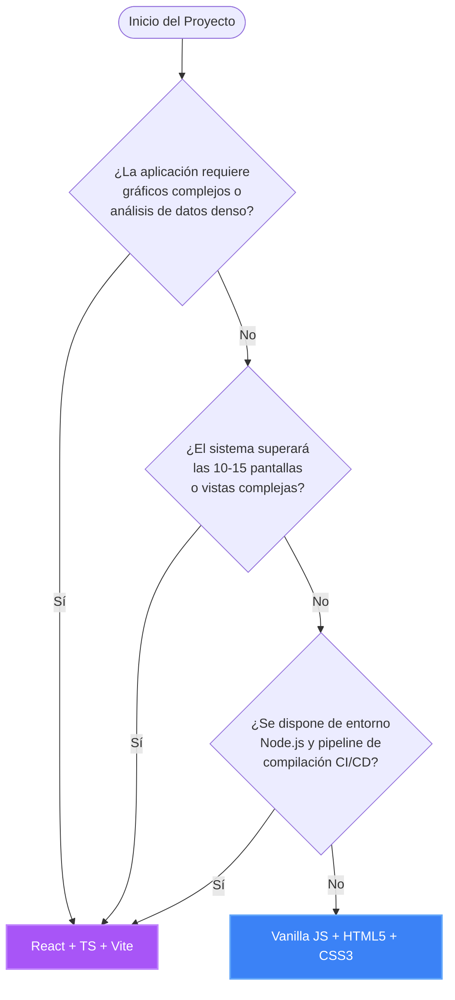

# Guía de Selección Tecnológica Frontend: Vanilla JS vs. React + TypeScript

Este documento sirve como marco de decisión arquitectónica para definir qué tecnología utilizar en el desarrollo de la interfaz de usuario (frontend) de futuras aplicaciones dentro de la organización, tomando como referencia los dos sistemas actuales: **CRM Sumelga** (desarrollo nativo ligero) y **KPI_Comercial** (desarrollo basado en componentes React).

---

## 🧭 Árbol de Decisión (¿Qué tecnología elegir?)

Utiliza el siguiente diagrama de flujo para identificar la pila tecnológica adecuada para tu nuevo proyecto:

---

## 🛠️ Comparativa de Tecnologías

### 1. Vanilla Javascript (Pila Nativa)
*Desarrollo directo utilizando los estándares nativos del navegador: HTML5, CSS3 y ECMAScript (JS) sin empaquetadores ni frameworks.*

* **Ideal para**: Aplicaciones de gestión interna de tamaño pequeño a mediano, herramientas basadas en formularios (CRUD), sistemas con recursos de servidor limitados, o proyectos con despliegue embebido directo (FastAPI serving static assets).

#### 🟢 Puntos Fuertes (Pros)
* **Rendimiento e instantaneidad**: Sin sobrecarga de frameworks ni DOM virtual. Carga inmediata en cualquier dispositivo.
* **Simplicidad de infraestructura**: No requiere instalación de Node.js, `npm`, ni procesos de compilación. Elimina problemas de dependencias rotas a largo plazo.
* **Fácil despliegue**: Los archivos se sirven directamente como contenido estático, facilitando su alojamiento en cualquier servidor web ligero o API (ej. FastAPI `/static`).
* **Inmortalidad tecnológica**: Los estándares de los navegadores son estables. El código escrito hoy funcionará de forma idéntica en 10 años sin necesidad de mantenimiento preventivo.

#### 🔴 Puntos Débiles (Contras)
* **Dificultad de sincronización de estado**: El desarrollador debe manipular manualmente el DOM ante cambios de datos (`innerHTML`, `innerText`), aumentando el riesgo de errores visuales a medida que la app escala.
* **Código menos modular**: Carece de un sistema de componentes nativo. Reutilizar elementos de interfaz requiere duplicar código HTML o concatenar strings dinámicos en JS.
* **Complejidad de mantenimiento en proyectos grandes**: Las aplicaciones que superan un tamaño medio tienden a volverse difíciles de mantener e integrar en equipos de trabajo numerosos.
* **Riesgo de cuellos de botella en el DOM**: La manipulación ineficiente del DOM (como concatenar opciones o filas de tablas mediante `.innerHTML +=` dentro de bucles sobre colecciones de gran tamaño) bloquea el hilo principal de renderizado del navegador. En aplicaciones Vanilla JS con grandes volúmenes de datos, es mandatorio construir las cadenas HTML en memoria y realizar una única asignación al DOM al finalizar el bucle.

---

### 2. React + TypeScript + Vite (Pila de Componentes)
*Arquitectura modular basada en componentes visuales con tipado estático seguro y empaquetado ultra-rápido en desarrollo.*

* **Ideal para**: Paneles de control (Dashboards) analíticos interactivos, herramientas con visualizaciones complejas (gráficos dinámicos, matrices de cruce de datos, filtros cruzados interactivos) o proyectos de gran envergadura escalables con equipos de varios desarrolladores.

#### 🟢 Puntos Fuertes (Pros)
* **Modularidad y componentes**: La UI se divide en bloques independientes, aislados y reutilizables (ej. `<GraficoMensual />`, `<TablaClientes />`), facilitando la legibilidad y mantenimiento del código.
* **Modelo de datos declarativo**: React gestiona el DOM automáticamente mediante su DOM Virtual. El programador solo declara cómo debe verse la UI en base a las variables de estado, y la librería optimiza el renderizado de forma transparente.
* **Robustez y tipado estático**: TypeScript detecta errores de código y discrepancias en respuestas de APIs en tiempo de desarrollo (antes de compilar), evitando fallos fatales ante el usuario final.
* **Ecosistema masivo**: Acceso inmediato a miles de librerías optimizadas para React (gráficos dinámicos, mapas interactivos, paginación avanzada, animaciones complejas).

#### 🔴 Puntos Débiles (Contras)
* **Etapa de build obligatoria**: Requiere Node.js en desarrollo y producción para compilar TypeScript y empaquetar el bundle final.
* **Mayor peso de descarga**: La aplicación debe descargar el núcleo de React y de las librerías adicionales antes de poder mostrar el primer píxel, incrementando el tiempo de carga en conexiones móviles lentas.
* **Curva de aprendizaje elevada**: Exige dominar conceptos avanzados de desarrollo web moderno (JSX, Hooks de React, interfaces de TypeScript, configuraciones de empaquetadores como Vite).

---

## 📊 Matriz de Criterios de Selección

| Requisito del Proyecto | Vanilla JS (Nativo) | React + TypeScript | Recomendación |
| :--- | :---: | :---: | :---: |
| **Peso del Bundle / Carga rápida** | **~50 KB** (Instantáneo) | **>500 KB** (Normal) | **Vanilla JS** |
| **Integridad / Cero errores tipográficos** | 🟡 Depende del testing | **🟢 Alta (TypeScript)** | **React + TS** |
| **Integración de gráficos dinámicos** | 🟡 Compleja (A mano) | **🟢 Excelente (Recharts)** | **React + TS** |
| **Formularios simples y CRUDs rápidos** | **🟢 Muy ágil** | 🟡 Sobrecarga de código | **Vanilla JS** |
| **Mantenimiento en equipos grandes** | 🟡 Complejo de estandarizar | **🟢 Excelente (Estructurado)** | **React + TS** |
| **Dependencia del ecosistema Node.js** | **🟢 Ninguna** | 🔴 Alta | **Vanilla JS** |

---

## 💡 Recomendaciones del Arquitecto

1. **Elige Vanilla JS** si vas a crear una aplicación operativa rápida orientada a la entrada y consulta de datos (como fichas, formularios, minutas, tableros Kanban interactivos, etc.) y deseas que su despliegue sea extremadamente simple (ej. un ejecutable de Python FastAPI que levanta todo el sistema localmente sin Node.js).
2. **Elige React + TypeScript** si vas a construir una aplicación densa de analítica de negocio (KPIs interanuales, rankings, cruce de miles de registros de compras en matrices interactivas) o que exija gráficos dinámicos y reportes avanzados, donde la arquitectura declarativa de React y la seguridad de tipos de TypeScript compensen el coste de configurar y mantener un entorno Node.js.
